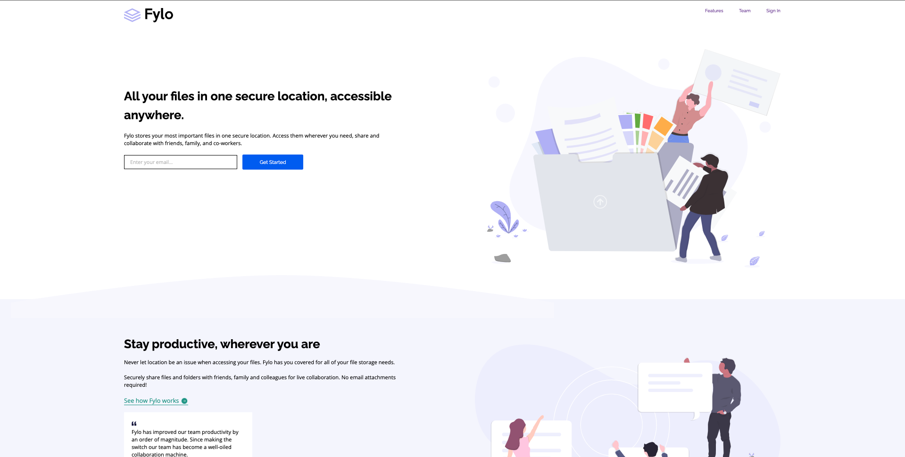
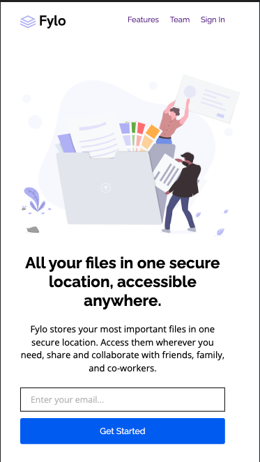

# Frontend Mentor - Fylo landing page with two column layout solution

## Table of contents

- [Overview](#overview)
  - [The challenge](#the-challenge)
  - [Screenshot](#screenshot)
- [My process](#my-process)
  - [Built with](#built-with)
  - [What I learned](#what-i-learned)
- [Author](#author)

## Overview

### The challenge

Users should be able to:

- View the optimal layout for the site depending on their device's screen size
- See hover states for all interactive elements on the page

### Screenshot

Desktop view ->  
Mobile view -> 

## My process

First I started with creating the layout of the mobile view. Once that Was complete, I added the fonts and color to the elements. Last I styled the desktop view and added the active styling for the buttons and links. 

### Built with

- Semantic HTML5 markup
- CSS custom properties
- Flexbox
- CSS Grid
- Mobile-first workflow

### What I learned

The main thing that I learned on this project, was not adding padding to the body. I thought that this would make it easier to style the sections, but it was the opposite. Espically on the #stay-product-cont where I needed to make the background color fit the whole cont. The padding on the body made this a bit tricker and I had to use negative numbers. 

Another thing that I learned on this project, was the importance of taking time to actually plan the project and not just jumping in. 

## Author

- Website - [Terrell Tinsley](https://www.ttinsley.dev)
- Frontend Mentor - [@TRellTins](https://www.frontendmentor.io/profile/trelltins)
- Twitter - [@TRellTinsley](https://www.twitter.com/TRellTinsley)

